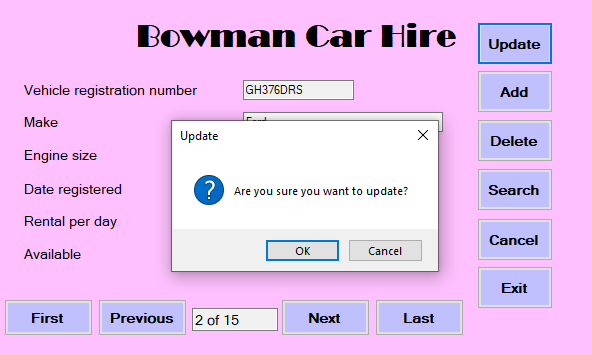

# CarsDatabase


This is a C# project completed as part of an assignment

The purpose of this software is to provide a user interface to allow a connection and access to an external database. It uses the CRUD (Create Read Update Delete) functionality that allows users to:
1. Create a new record by having an add button and being able to save it to the database.
   
   
2. Read the records by showing them on the main frmCars with navigation buttons to read through each one, plus a search button that brings a user to the frmSearch that allows search functionality to read certain records.

   
3. Update records in the database by allowing users to edit a certain record and click on the update button to update the newly edited record.

   
4. Delete records from the database by allowing users to remove a certain record from the database by clicking on the delete button.

   

**Connection Requirements:**

-	The database file which can be found in the Resources folder, must be called ‘hire.db’ and in order to connect to it must be located in the following file path ‘C:\data\hire.db’ in a data folder.

-	Microsoft Visual Studio 2022 Community Edition was downloaded from the vendor's website and used to code and run the software. The .NET framework along with Windows Form was used to produce the software GUI (Graphical User Interface) as required.

-	The NuGet package called ‘Stub.System.Data.SQLite.Core.NetFramework’ version 1.0.115.5 must be installed.

-	The ‘DB Browser for SQLite’ version 3.12.2 was downloaded from the vendor website in order to open the database file and see changes made in real-time.

-	The connection to the database was made in the **frmCars.cs** as follows:
```
// Connection to the database
public SQLiteConnection myDBConnection = new SQLiteConnection(@"data source=C:\data\hire.db");

// Makes table to store the data
public DataTable dtCars = new DataTable();
```
